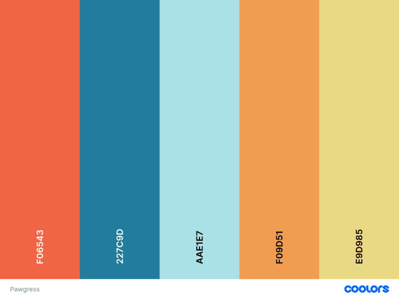
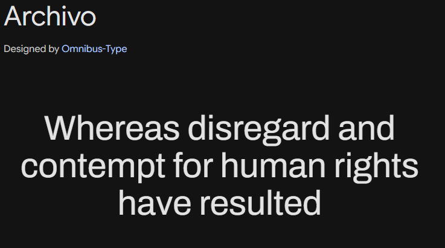
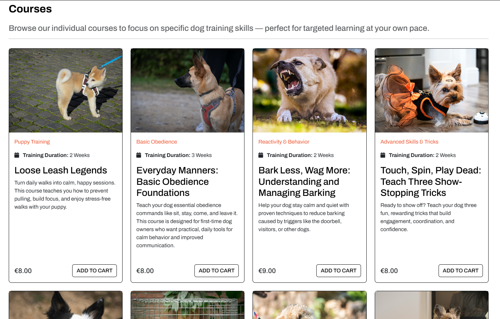
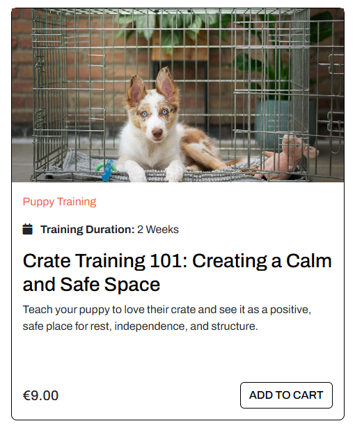
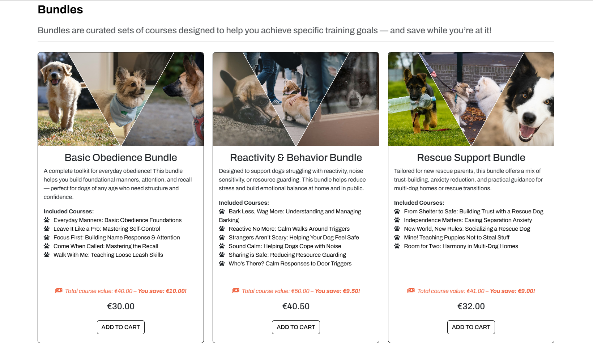
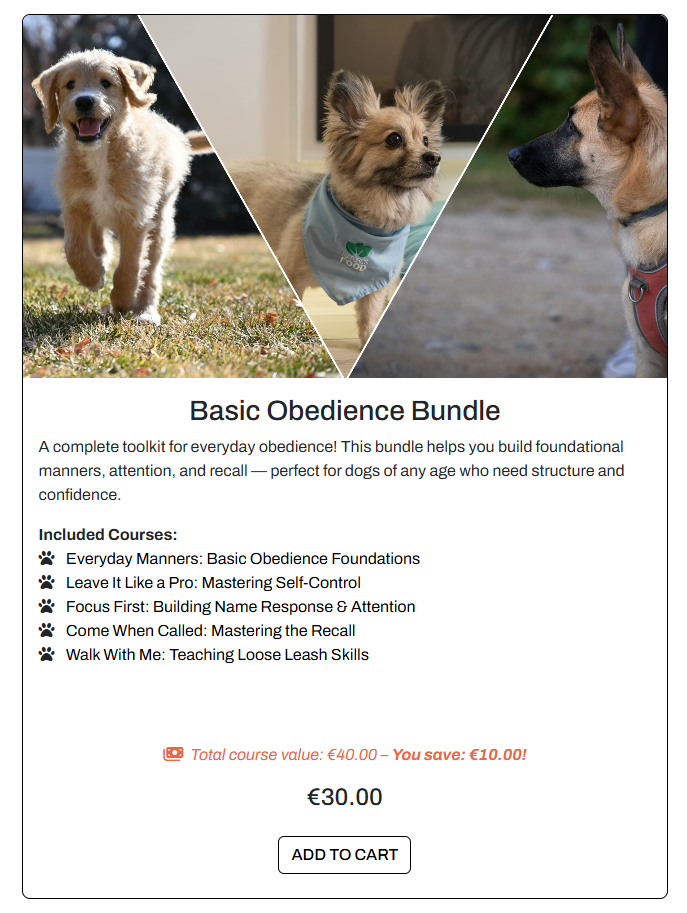

# Pawgress

[Responsiveness]()

[To see the Live site, click here!](https://pawgress-by-keszi94-02abbb46130d.herokuapp.com/)

## Contents

- [User Experience (UX)](#user-experience-ux)
  - [Target Audience](#target-audience)
  - [User Goals](#user-goals)
  - [Site Owner Goals](#site-owner-goals)
  - [UX Features](#ux-features)
- [Planning](#planning)
  - [User Stories](#user-stories)
  - [Wireframes](#wireframes)
  - [Database Schema](#database-schema)
- [Design](#design)
  - [Color Palette](#color-palette)
  - [Typography](#typography)
- [Features](#features)
- [Future Features](#future-features)
- [SEO and Web Marketing](#seo-and-web-marketing)
  - [Keyword Research](#keyword-research)
  - [Markting Strategy](#markting-strategy)
  - [SEO implementation](#seo-implementation)
- [Techonologies Used](#techonologies-used)
- [Testing](#testing)
- [Deployment](#deployment)
  - [Heroku Deployment](#heroku-deployment)
  - [How to Fork](#how-to-fork)
  - [How to Clone](#how-to-clone)
- [Credits](#credits)
  - [Code Used](#code-used)
  - [Content Used](#content-used)
  - [Media](#media)
  - [Acknowledgments](#acknowledgments)

## User Experience (UX)

### Target Audience
### User Goals
### Site Owner Goals
### UX Features

## Planning

### User Stories
### Wireframes
### Database Schema

## Design

### Color Palette

The color palette for the website was created using [coolors](https://coolors.co/).

### Typography

I have decided to use The font [Archivo](https://fonts.google.com/specimen/Archivo) from [Google Fonts](https://fonts.google.com/).

## Features

### Home Page

### Courses page

* The courses are displayed as cards and upon hovering the card size scales up.

  

* The course cards feature:
  * The course image
  * A Category link, which upon clicking will refresh the page and display only the courses under that category
  * The training duration of the course
  * The course description
  * The price of the course
  * An 'Add to Cart' button, which will add the course to the cart, except if the course is alredy in the cart, either by itself or in a bundle. The button changes background color when hovering ove it.
  
    

### Course Detail Pages

### Bundles page

* The Bundles are also displayed as cards and upon hovering the card size scales up.

   

* The bundle cards feature:
  * The bundle's image 
  * The bundle's title
  * The description
  * A list of the included courses, all of which are live links to their respected course detail page, so customers can read the individual course descriptions if they wish to
  * The added up total value of all the courses included and the amount of money a potential customer will save on the bundle, all calculated automatically. It is intentionally displayed above the total price of the bundle, so the first information the customer sees is how much money they can save on a bundle. The color grabs attention and there is an emphasis on the amount they can save, but the text size is smaller compared to the actual bundle price.
  * The actual discounted bundle price
  * An 'Add To Cart' button, which will add the bundle to the cart if it's not already in, or if there is no course in the cart already that is included in the bundle. The button changes background color upon hoverring over it.
  
    

* The bundles do not have detail pages, since upon purchase the customer gains access to all the courses included in the bundle, therefore they only need acces to the specific course detail pages

## Future Features

## SEO and Web Marketing

### Keyword Research
### Marketing Strategy
### SEO implementation

## Techonologies Used

  * Python 3 – Core programming language.

  * Django 5.2 – High-level Python web framework for rapid development and clean design.

  * PostgreSQL – Relational database, accessed via psycopg2.

  * Gunicorn – WSGI HTTP server for running the Django application in production.

  * Amazon S3 + Boto3 – For media and static file storage, integrated via django-storages.

  * Stripe API – Used for handling payments.

  * Django Allauth – Handles user authentication, registration, and third-party logins.

  * Crispy Forms with Bootstrap 5 – Enhaanced form rendering and styling.

  * django-countries – Provides a country field for Django models.

  * DefusedXML – Protects against XML-based security issues.

  * Flake8 – Tool for enforcing Python code style and linting.

  * Requests & OAuthLib – HTTP requests and OAuth support for external APIs.

  * Pillow – Python Imaging Library for image processing.

  * dj-database-url – Simplifies database configuration from environment variables.

  * Cryptography & CFFI – Used for secure data handling and encryption.

## Testing

All documentation regarding the testing on this project can be viewed in this seperate [TESTING.md file](TESTING.md)(use CTRL + Click to this or any of the following links in a new tab/window).
You can also navigate to a specific section of the file by selecting one of the content headings:

### Testing Contents

  - [Automated Testing](TESTING.md#automated-testing)
  - [Manual Testing](TESTING.md#manual-testing)
    - [Navigation](TESTING.md#navigation)
    - [Responsiveness](TESTING.md#responsiveness)
    - [Authentication](TESTING.md#authentication)
    - [CRUD Functionality](TESTING.md#crud-functionality)
  - [Validator Testing](TESTING.md#validator-testing)
    - [PEP8](TESTING.md#pep8)
    - [W3C](TESTING.md#w3c)
    - [JSHint](TESTING.md#jshint)
  - [Accessibility \& Performance](TESTING.md#accessibility--performance)
    - [WAVE](TESTING.md#wave)
    - [Lighthouse](TESTING.md#lighthouse)
  - [Bugs \& Bug Fixes](TESTING.md#bugs--bug-fixes)

## Deployment

### Heroku Deployment
### How to Fork
### How to Clone

## Credits

### Code Used

* I have grabbed various codes from the [Bootstrap Docs](https://getbootstrap.com/docs/5.3/getting-started/introduction/).
* I used [CSS Gradient.io](https://cssgradient.io/) to generate the css code for the courses detail page header background.
* All icons used on the side are from [Font Awesome](https://fontawesome.com/).
* For the purchase setup I used the official [Stripe documentation](https://docs.stripe.com/).
* I used [MailerLite](https://www.mailerlite.com/) for the newsletter implementation.

### Supporting Material

* [This article on bastakiss.com](https://bastakiss.com/blog/django-6/effective-implementation-of-django-templates-structure-inheritance-and-best-practices-800) helped me with template structuring.
* I gathered information from the [Django Documentation](https://www.djangoproject.com/) throughout the build.
* All Course and Bundle contents, including titles and descriptions were created by [ChatGPT](https://chatgpt.com/).
* [Flake8 documentation](https://flake8.pycqa.org/en/3.1.1/index.html)

### Media

#### Images Used

* Home page Image

  * Downloaded from [Freepik](https://www.freepik.com/free-photo/dog-copyspace_2009576.htm#fromView=keyword&page=1&position=1&uuid=19b1f879-d65e-4dd1-a018-704e55560ec9&query=Dog+Header)

---
* course images

  I shrank all the images using the [squoosh.app](https://squoosh.app/).

  Created the bundles collage images on [PhotoJoiner](https://www.photojoiner.com/).

    * [Anastasiya Badun](https://unsplash.com/@badun?utm_content=creditCopyText&utm_medium=referral&utm_source=unsplash") on [Unsplash](https://unsplash.com/photos/a-brown-and-black-dog-standing-on-top-of-a-dirt-road-Xffr7rCo98s?utm_content=creditCopyText&utm_medium=referral&utm_source=unsplash)
 
    * [Roger Granquist](https://unsplash.com/@rogergranquist?utm_content=creditCopyText&utm_medium=referral&utm_source=unsplash) on [Unsplash](https://unsplash.com/photos/a-dog-with-a-leash-standing-next-to-another-dog-1y7n5lEL10U?utm_content=creditCopyText&utm_medium=referral&utm_source=unsplash)

    * [Pedro Sanz](https://unsplash.com/@pedrosanz) on [Unsplash](https://unsplash.com/photos/a-black-and-white-dog-with-a-green-vest-7g835S-CD7o)

    * [Chris Andrawes](https://unsplash.com/@candrawes) on [Unsplash](https://unsplash.com/photos/a-black-dog-sitting-on-top-of-a-lush-green-field-eXjbusp1whU)

    * [Giorgio Trovato](https://unsplash.com/@giorgiotrovato) on [Unsplash](https://unsplash.com/photos/a-small-black-and-white-dog-being-held-by-a-person-eIQyI6p18lA)

    * [Haberdoedas](https://unsplash.com/@haberdoedas) on [Unsplash](https://unsplash.com/photos/a-man-walking-two-dogs-on-a-leash-ldwgxjQZssE)

    * [Ahmed](https://unsplash.com/@mutecevvil) on [Unsplash](https://unsplash.com/photos/a-woman-walking-a-dog-on-a-leash-BDm88bTJqTk)

    * [nygi](https://unsplash.com/@nyegi) on [Unsplash](https://unsplash.com/photos/a-dog-running-with-a-toy-in-its-mouth-gSg0_8RPQfs)

    * [Nika Benedictova](https://unsplash.com/@nika_benedictova) on [Unsplash](https://unsplash.com/photos/a-brown-and-white-dog-wearing-a-harness-on-a-leash-UdsCoVI0Zvs)

    * [Ayla Verschueren](https://unsplash.com/@moob) on Unsplash. [photo 1](https://unsplash.com/photos/golden-retriever-puppy-lying-on-black-and-white-polka-dot-textile-7ski9cyE6UA), [photo 2](https://unsplash.com/photos/a-brown-and-white-dog-inside-of-a-cage-qvbG3-tZnyc), [photo 3](https://unsplash.com/photos/a-dog-playing-with-toys-on-a-bed-xuKLNbSvovg), [photo 4](https://unsplash.com/photos/a-puppy-playing-with-toilet-paper-on-the-floor-OvjdkIbrS8A)

    * [Alexas_Fotos](https://unsplash.com/@alexas_fotos) on [Unsplash](https://unsplash.com/photos/white-and-brown-short-coated-dog-lying-on-green-grass-during-daytime-8UW56BhhUoc)

    * [Matt Walsh](https://unsplash.com/@two_tees) on [Unsplash](https://unsplash.com/photos/brown-and-black-yorkshire-terrier-puppy-on-brown-textile-DyMOyjolcHE)

    * [Real Natures Food](https://unsplash.com/@realnaturesfood) on [Unsplash](https://unsplash.com/photos/a-small-dog-standing-next-to-a-stuffed-animal-hd815_vNH_g)

    * [Angelica Jasmin](https://unsplash.com/@angelovehearts) on [Unsplash](https://unsplash.com/photos/a-close-up-of-a-dogs-face-with-a-blurry-background-rleV8DUKxho)

    * [Ilyuza Mingazova](https://unsplash.com/@ilyuza) on [Unsplash](https://unsplash.com/photos/person-in-blue-denim-jeans-and-blue-nike-sneakers-walking-with-brown-and-white-short-coated-duuiIvcQMwU)

    * [Andy Powell](https://unsplash.com/@dina0312) on [Unsplash](https://unsplash.com/photos/black-and-white-border-collie-puppy-playing-with-green-ball-on-green-grass-field-during-daytime-GuE_qLQ_Ej8)

    * [Tharun Kumar](https://unsplash.com/@tharunk908) on [Unsplash](https://unsplash.com/photos/a-man-and-his-dog-watching-the-fireworks-G9UEieflIs0)

    * [Anjuli Anjuli](https://unsplash.com/@aplouzek) on [Unsplash](https://unsplash.com/photos/white-long-coated-dog-on-green-grass-field-during-daytime-ns8Oj-pke9I)

    * [Chris Benson](https://unsplash.com/@lordmaui) on [Unsplash](https://unsplash.com/photos/puppy-beside-pet-bowl-b5YQQbMSWhQ)

    * [Robert Eklund](https://unsplash.com/@roberteklund) on [Unsplash](https://unsplash.com/photos/girl-in-blue-t-shirt-and-blue-denim-shorts-holding-leash-of-white-and-brown-jack-dv_R483YAQs)

    * [Robin Jonathan Deutsch](https://unsplash.com/@rodeutsch) on [Unsplash](https://unsplash.com/photos/black-and-white-short-coated-dog-on-window-y__cEjgHUZE)

    * [Ugur Arpaci](https://unsplash.com/@ugurarpaci) on [Unsplash](https://unsplash.com/photos/a-white-dog-standing-on-top-of-a-leaf-covered-ground-JXkQe3V40Wo)

* 404 page image

    * Downloaded from [Rawpixel](https://www.rawpixel.com/image/9221355/black-pug-dog-png-transparent-background)

* Favicons
  
    * The favicons were created on [favicon.io](https://favicon.io/)

### Acknowledgments