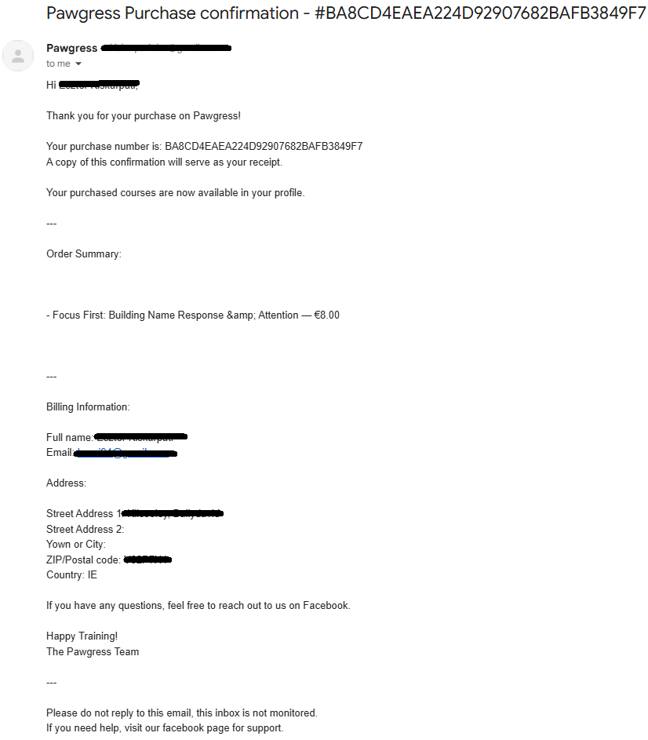
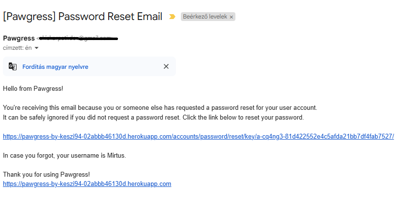

# Pawgress


Pawgress is an online platform dedicated to helping dog owners build stronger, smarter relationships with their furry companions. Whether you're welcoming a puppy into your home, working through behavioral challenges or simply looking to sharpen your dog’s advanced skills, Pawgress offers a wide selection of professional training courses to guide you evry step of the way. Designed with accessibility, simplicity and professionalism in mind, the site provides a smooth and supportive learning experience for both seasoned owners and first time dog parents.

[To visit the Live site, click here!](https://pawgress-by-keszi94-02abbb46130d.herokuapp.com/)

## Contents

- [User Experience (UX)](#user-experience-ux)
  - [Target Audience](#target-audience)
  - [User Goals](#user-goals)
  - [Site Owner Goals](#site-owner-goals)
  - [UX Features](#ux-features)
- [Planning](#planning)
  - [User Stories](#user-stories)
  - [Wireframes](#wireframes)
  - [Database Schema](#database-schema)
- [Design](#design)
  - [Color Palette](#color-palette)
  - [Typography](#typography)
- [Features](#features)
- [Future Features](#future-features)
- [SEO and Web Marketing](#seo-and-web-marketing)
  - [Keyword Research](#keyword-research)
  - [Markting Strategy](#markting-strategy)
  - [SEO implementation](#seo-implementation)
- [Techonologies Used](#techonologies-used)
- [Testing](#testing)
- [Deployment](#deployment)
  - [Heroku Deployment](#heroku-deployment)
  - [How to Fork](#how-to-fork)
  - [How to Clone](#how-to-clone)
- [Credits](#credits)
  - [Code Used](#code-used)
  - [Content Used](#content-used)
  - [Media](#media)
  - [Acknowledgments](#acknowledgments)


## User Experience (UX)

### Target Audience

Pawgress is aimed at dog owners of all experience levels who are looking for accessible, structured at-home training courses online. This includes first time puppy owners, adopters of rescue dogs, and more experienced handlers looking to build new skills.

### User Goals

* Quickly find suitable dog training courses for their needs.
* Understand what each course or bundle offers before purchasing.
* Easily navigate the site and make secure purchases.
* Track their owned courses and progress over time.

### Site Owner Goals

* Present a clean, professional, and trustworthy platform for showcasing courses.
* Make it easy for users to browse, buy and access their training courses.
* Encourage signups to the newsletter for ongoing engagement.
* Maintain a good user experience across all screen sizes and devices.
* Demonstrate good development practices.

### UX Features

* Clear call-to-action button on the homepage to guide users toward browsing courses.
* Consistent navigation with mobile friendly responsiveness.
* Cards for each course and bundle, making the info clear and esy to read.
* A “My Courses” page to track purchased and completed courses.
* Use of icons and styling for improved readablity and accessibility.
* Visual feedback for functions adding to cart, delete from cart, etc.

## Planning

### User Stories

The project was structured around six milestones, each focusing on a different stage of devlopment. These milestones were broken down into development goals and user stories. Features were prioritized using the MoSCoW method, making sure the most important parts were built first.
More details on the project's progress and priorities can be found on te [Pawgress Kanban Board](https://github.com/users/Keszi94/projects/7/views/1).


* Milestone 1 - User Accounts and Authentication

  * Easily register for an account
  * Easily log in and out
  * Recieve confirmation email after registering
  * Easily recover my password

* Milestone 2 - Viewing and Navigation

  * Browse all available training courses
  * View individual course details
  * See my current total while browsing
  * Recieve feedback on actions across the site
  * See the course's duration time
  * See the actual value of courses and the amount saved with bundles
  * Accessing purchased course content - from courses page
  * Accessing purchased course content - from My courses page

* Milestone 3 - Sorting and Searching

  * Find courses using search
  * Find courses by categories

* Milestone 4 - Checkout and Payments

  * Add course to cart from courses list page
  * View shopping cart
  * Remove previously added item from the cart
  * Choose the Country easily in the checkout form
  * Enter payment details easily
  * View and manage purchases in admin panel
  * View a purchase confirmation
  * Receive an email receipt

* Milestone 5 - Admin CRUD

  * Add courses to the site
  * Create a Bundle with existing courses
  * Creating courses on the front-end
  * Deleting Courses on the front-end
  * Editing Courses on the front-end

* Milestone 6 - Dev

  * Set up Bootstrap and base template
  * Configure Django authentication system
  * Add Favicons
  * Add unit tests for site features
  * Add meta tags (Essential Meta Tags Open Graph, Twitter Cards)

### Wireframes
### Database Schema

The database structure for this project centers around Django’s built-in User model, which manages authentication and user identity. From there, several other models are connected to enable core functionality for course purchases, content management and user progress tracking.

* Each user can purchase multiple items (courses and/or bundles).
* A Purchase contains one or more PurchaseItem entries, which can reference either a Course or a Bundle.
* A Bundle groups multiple Courses, allowing users to buy several related trainings together at a discounted price.
* Courses are categorized via the Category model, and each Course belongs to one Category.

This design supports many-to-many relationships where needed (e.g.: bundles and courses) and avoids duplication by handling content and purchasing logic separately.


## Design

### Color Palette


The color palette for the website was created using [coolors](https://coolors.co/).
The color palette was one of the very first things I worked on when starting to style the site. I pulled the main light blue (#AAE1E7) straight from the homepage hero image, since it had a nice soft and friendly tone that felt right for the site. From there, I used Coolors to build out a full palette that would complement it, adding both warmer and cooler tones to give the site a cheerful but professiomal feel. The mix helped set the overall mood and made it easier to keep the design consistent across all the pages. The two main colors are deep orange(#F06543) and the aforementioned light blue (#AAE1E7) that are used on almost all the buttons on the site.

### Typography

I have decided to use The font [Archivo](https://fonts.google.com/specimen/Archivo) from [Google Fonts](https://fonts.google.com/). Archivo was designed for high-performance typography, which makes it a great fit for both large headlines and smaller body text. I like that it's modern and clean, which gives the site a professional and trustworthy feel while still being friendly and approachable. It's the ideal font for a site aimed at helping people train their dogs. It also pairs well with the site's minimal design and performs well across devices and screen sizes.


## Features

### Home Page

* On the home page, just below the main header, there's a "Browse Courses" button that directs users straight to the course listings, making it quick and convenient to browse the content they're looking for. The button changes color upon hoverig, for a more interactive feel

  

* Just below the header text and "Browse courses" button, there’s a short "About Us" section to help visitors quickly understand what the site is about. Directly underneath are iconsl inking to the site's social media platforms. Each of the icons change color when hovered over, for a more interactive feel.

  

* The homepage also features a “Subscribe to our Newsletter” section, giving users an easy way to stay updated with new courses, promotions and news. The form is quick to fill out, only requires an email address. A friendly success message confirms when the subscription is complete.

  

### Courses page

* The courses are displayed as cards and upon hovering the card size scales up for an interactive effect.

  

* The course cards feature:
  * The course image
  * A Category link, which upon clicking will refresh the page and display only the courses under that category
  * The training duration of the course
  * The course's description
  * The price of the course
  * An 'Add to Cart' button, which will add the course to the cart unless:
      <br>– It is already in the cart, either directly or inside a bundle
      <br>– The course is already owned by the user
      <br>The button also changes color on hover.
 
  
    

### Course Detail Pages

There are two views for all the course detail pages:

  * If the user does **not** own the course:

    * The course image
    * The course description
    * The estimated duration
    * a text informing the user that the content is only available after purchase
    * An "add to cart" button which: 
      
      <br>– For logged-in users, it adds the course to their cart 
      <br>– For anonymous users, it redirects to the login page

    

* If the user **owns** the course, the full course content becomes visible, including:
  
  * The full training content becomes visible in plae of the message and "Add to cart" button

  

### Bundles page

* Like the coursses, bundles are displayed as cards and each card scales up slightly when hovered over.

   

* The bundle cards feature:
  * The bundle image 
  * The bundle title
  * The description
  * A list of the included courses, each one linking to its respective course detail page so customers can read the individual course descriptions if they wish to
  * The added up total value of all the courses included and the amount of money a potential customer will save on the bundle, all calculated automatically. It is intentionally displayed above the total price of the bundle, to first highlight how much money a customer can save on a bundle. The amount saved is displayed with attention-grabbing color, and there is an emphasis on the amount they can save, but uses a smaller font size then the actual bundle price.
  * The actual, discounted bundle price
  * An 'Add To Cart' button, which will add the bundle to the cart as long as: 
    
    <br>– The bundle itself is not already in the cart
    <br>– None of the courses inside the bundle are already in the cart
    <br>- If the user owns any course in the bundle, a warning message will list those specific courses, but still adds the bundle to the cart, because it would be wrong to refuse purchase on a discounted item
    
    <br>This ensures transparency, as only individual courses (not bundles) are tracked for ownership.
    <br>The button also changes color on hover for visual feedback.
  
    

* The bundles do not have detail pages, since upon purchase the customer gains access to all the courses included in the bundle, therefore they only need acces to the specific course detail pages

### Navigation

The site features a responsive and intuitive navigation bar, designed for both desktop and mobile users.


* On larger screens, the logo is positioned on the left side of the navbar and links back to the homepage.
* On smaller screens, the navbar adapts using a burger menu. The navigation items stack vertically, and all interactive elements (search, account, cart) remain accessible and functional.
    
  

* Because of burger menu positioning, the logo shifts below the menu in the top left corner of the page and remains a clickable link to the homepage. Keeping the logo on all screen sizes helps visitors remember what site they are on.

  

* Located at the center of the navbar is a search bar that allows users to easily search for courses. The search functionality checks both course and bundle titles, as well as the content of each course to deliver more relevant results. The search button is clearly visible for quick access.

* Under the search bar, in the center of the page are the main nav links:
  * Home
  * All Courses
  * Courses by Category (with a dropdown for filtering)
  * Course Bundles

  

* The Account icon, located on the right side of the navbar, opens a dropdown for:
  *  registration and login/logout
  *  'My courses' for logged in users
  *  'Add New Course' for site admins
  
      
      

* To the right of the account is the Cart icon, which displays the total cart value in real-time if anything is in there.

This layout ensures users can easily navigate the site, regardless of the device they’re using.

### Cart and Checkout

* Cart page:

  The cart displays all added items, both individual courses and bundles with key details including the course/bundle title, price, and image. Each item has a clearly labeled "Remove from Cart" link, allowing for easy adjustments. The total cost is displayed at the bottom, along with two buttons:

  * Keep Browsing takes users back to the courses page
  * Secure Checkout proceeds to the Checkout page
  * When the cart is empty, the user can browse on using the "Browse Courses" butoon, which takes them to the courses page

  

* Checkout page:

  At checkout, users are presented with a summary of their order alongside a simple, clean form to fill out their billing details. Stripe is integrated for secure payment handling.

  * The Country field in the checkout form is a dropdown menu powered by Django’s `django_countries` package, helping users select their country quickly and reducing teh input errors.
  * With the use of the "Adjust Cart" button, users can still go back and adjust the cart if they wish to
  * A clear message shows the total amount charged
  * The "Complete Purchase" button will become unclickable after the charging process starts
  * After a successful purchase, the page redirects to the "Checkout Success" page

  

* Checkout Success page:

  Upon successful payment, users are directed to a confirmation page.

    * A success message confirms the order, and a summary lists all purchased items
    * A purchase ref. number is created and displayed
    * A "Back to Courses" button helps users return to the courses page
    * An email confirmation is sent automatically

    
    

This flow ensures a smooth experience with minimal issues, even for first time users.

### My Courses page

Courses that have been purchased, either individually or through a bundle are displayed here with the familiar card layout, same as the Courses and Bundles pages. Each card includes the course image, title, training duration, and description. Both the image and the title are clickable and take the user to the course detail page.

A unique feature of this page is the “Mark as completed” checkbox. This allows users to keep track of their progress manually, giving them a simple way to monitor which courses they've already worked through.


### Admin CRUD: Add/Edit/Delete Courses via Front-End

* Admins can add new courses directly through a user-friendly front-end form. The form icludes fields for: 
  * title
  * description
  * detailed content - the content field is enhanced with CKEditor, which allows admins to use rich text formatting for easier styling of the course material
  * category dropdown
  * estimated course duration dropdown
  * image upload
  * price

  

* Courses can also be edited or deleted from the Courses page. These options are only visible to superusers. When editing, the form is pre-populated with the course’s existing data. Before deletion, JavaScript is used to trigger a browser confirmation, asking the user to confirm the action. 

  
  

### Authentication

* Registration

  Users can register with an email and password, or sign up using Google via OAuth integration. After registering, a confirmation email is sent with a confirmation link to verify the account.

  
  
* Login & Logout

  Login and logout are handled through styled, user-friendly forms. The login page supports both traditional and Google login options.

  

  
  

* Password Reset

  Users can request a password reset by entering their email. A reset link is then sent to their inbox for secure recovery.

  
  
* Email Confirmation & Testing

  All email-related flows (registration confirmation and password reset) have been tested and verified to work correctly, the email templates are styled and clear.

    
    


### Toast Messages

Pawgress implements toast messages across the site to provide immediate feedback to users based on their interactions. These messages appear at the top of the screen and are color-coded for clarity: green for success, blue for alerts, yellow for warnings and red for the errors.
The success and info messages dissappear after a few seconds, so users don't have to manually exit them.

* Success (green) toasts notify users of actions like:
    * successful login
    * successful purchase 
    * course creation/deletion/edit
    * succesful login/logout
    * adding/deleting courses or bundles displays a full rundown on the current state of the cart with a go to cart button for ease of use

  
  

  
  

* Info (Alert - blue) toasts notify users if:
    * a course is already in their cart
    * if they attempt to add a course they already own
  
  
  

  
  
  
* Warnings (yellow) are used for:
    * when users add a bundle to the cart that contains courses they already own. The message lists those specific courses, but the bundle is still added to the cart
  
  

* Error (red) toasts are:
    * Used when an action can’t be completed, for example submitting an empty search form.

  

This system helps ensure that users are informed about the outcome of their actions in a clear and unobtrusive way.

### Custom 404 page

A custom 404 error page has been implemented to provide a friendly fallback when users navigate to a non-existent page. It features a friendly image and a clear message, along with a button that takes users back to the home page, helping them find their way back to the site.


## Future Features

All these features can be also viewed in the project's [Kanban board](https://github.com/users/Keszi94/projects/7/views/1) inside the "Ignored" column.

* Have a personalised profile
* Easily manage a wishlist from the My Profile page
* Creating Bndles on the front-end (admin)
* Deleting Bundles on the front-end (admin)
* Editing Bundles on the front-end (admion)

## SEO and Web Marketing

### Keyword Research

Before beginning development, I conducted keyword research to identify relevant terms and queries the users might search for when looking for things related to dog training. The research focused on general dog training, owner support, and home based solutions.
This helped with both the course content and the SEO strategy.


### Marketing Strategy

To begin building engagement, I created a mock [Facebook page](https://www.facebook.com/profile.php?id=61575934871651) for Pawgress. Since Facebook often removes test pages, I’ve took a screenshots of the page.


I also integrated newsletter signup using [MailerLite](https://www.mailerlite.com/). At the time of submission, my account is stil under review so while no emails have been sent yet, the sign-up form works correctly and the subscribers are being collected successfully. 

Preview of the welcome email:

  

  

### SEO implementation

To improve search engine visibility and user experience, several SEO best practices were implemented:

* Meta Tags:
  
  These include a short description of the site, some keywords, and basic informaion for search engines such as who made the site and whether it should be indexed.

  Example:

  ```html
  <meta name="description" content="Pawgress is a premium platform offering dog training courses and bundles created by professionals. Train your pup with confidence, at home.">
  <meta name="keywords" content="dog training, online dog training, dog courses, puppy training, dog behavior, pawgress, dog training at home, online dog training courses">
  ```

* Open Graph and Twitter Cards:
  
  These make sure that if someone shares the site on platforms like Facebook or Twitter it shows a proper preview with a title, image, and description.

* Favicon & Web Manifest:
  
  I set up favicons in all the right sizes and added a manifest file so the site works better across devices and platforms.

## Techonologies Used

  * Python 3 – Core programming language.

  * Django 5.2 – High level Python web framework for rapid development and clean design.

  * PostgreSQL – Relational database, accessed via psycopg2.

  * Gunicorn – WSGI HTTP server for running the Django application in production.

  * Stripe API – Used for handling payments.

  * Django Allauth – Handles user authentication, registration, and third-party logins.

  * Crispy Forms with Bootstrap 5 – Enhaanced form rendering and styling.

  * django-countries – Provides a country field for Django models.

  * DefusedXML – Protects against XML-based security issues.

  * Flake8 – Tool for enforcing Python code style and linting.

  * Requests & OAuthLib – HTTP requests and OAuth support for external APIs.

  * Pillow – Python Imaging Library for image processing.

  * Cryptography & CFFI – Used for secure data handling and encryption.

  * Django CKEditor – Rich text editor for Django, used for course content creation.

  * Django Cloudinary Storage – Enables integration with Cloudinary for storing uploaded media files: course and bundle images.

  * Python3 openid – Used by Django Allauth to support third-party authentication, this instance Google sign-in.

  * Whitenoise – Serves static files (like CSS and JavaScript) directly in production without extra setup.


## Testing

All documentation regarding the testing on this project can be viewed in this seperate [TESTING.md file](TESTING.md)(use CTRL + Click to this or any of the following links in a new tab/window).
You can also navigate to a specific section of the file by selecting one of the content headings:

### Testing Contents

  - [Automated Testing](TESTING.md#automated-testing)
  - [Manual Testing](TESTING.md#manual-testing)
    - [Navigation](TESTING.md#navigation)
    - [Responsiveness](TESTING.md#responsiveness)
    - [Authentication](TESTING.md#authentication)
    - [CRUD Functionality](TESTING.md#crud-functionality)
  - [Validator Testing](TESTING.md#validator-testing)
    - [PEP8](TESTING.md#pep8)
    - [W3C](TESTING.md#w3c)
    - [JSHint](TESTING.md#jshint)
  - [Accessibility \& Performance](TESTING.md#accessibility--performance)
    - [WAVE](TESTING.md#wave)
    - [Lighthouse](TESTING.md#lighthouse)
  - [Bugs \& Bug Fixes](TESTING.md#bugs--bug-fixes)

## Deployment

### Heroku Deployment

This site is deployed to and currently hosted on the Heroku platform. The steps for deploying to Heroku with a custom PostgreSQL database setup are as follows:

1. PostgreSQL Database Setup
 * Navigate to [PostgreSQL from Code Institute](https://dbs.ci-dbs.net/).
 * Enter your student email address in the input field provided.
 * Click Submit.
 * Wait while the database is created.
 * Once the database is successfully created, check your student email inbox for further details.

2. Django Project Settings

* In the project workspace, navigate to/create a file named Procfile (remember the capital 'P'). Add the following code (replace <myapp> with your actual app name) and save the file:
  ```makefile
  web: gunicorn pawgress-by-keszi94.wsgi
   ```
* Now, create a file named env.py and add the following code, replacing <myurl> with your database URL and <mykey> with a secret key string. Save the file:
  ```python
  import os

  os.environ["DATABASE_URL"] = "your-url-here"
  os.environ["SECRET_KEY"] = "your-secret-key-here"
  ```
* Open settings.py and add the following imports near the top of the file:
  ```python
  import os
  import dj_database_url
  if os.path.isfile('env.py'):
    import env
  ```
* Replace the SECRET_KEY and DATABASES variables with the following:
  ```python
  SECRET_KEY = os.environ.get('SECRET_KEY')

  DATABASES = {
      'default': dj_database_url.parse(os.environ.get("DATABASE_URL"))
  }
  ```
* Save the file, then run ```python manage.py migrate``` in the terminal to apply any database migrations.

3. Push Changes to Repository
 * Commit and push these changes to the repository to update your project.

4.  Heroku Setup
* Navigate to Heroku and log in or create an account.
* Click "New" in the top right and select "Create New App."
* Enter a unique app name, choose a region, then click "Create app."
* Go to the "Settings" tab and click "Reveal Config Vars." Add the following:
     * ```DATABASE_URL```: Your database URL from the previous setup.
     * ```SECRET_KEY```: Your secret key.
     * ```PORT```: 8000 (default port for Heroku apps).
* Go to the "Deploy" tab, select "GitHub" under "Deployment method," and connect your repository.
* Scroll down and click "Deploy Branch" to complete the deployment process.

### How to Fork

1. Log in to your GitHub account.
2. Navigate to the ['Pawgress' GitHub repository](https://github.com/Keszi94/pawgress).
3. In the top right corner of the page, click the "Fork" button.
4. Select your GitHub account or organization where you want to fork the repository.
5. You now have a copy of the repository in your own account to make changes.

### How to Clone

1. Log in to your GitHub account.
2. Navigate to the ['Pawgress' GitHub repository](https://github.com/Keszi94/pawgress).
3. Click on the "Code" button and ensure "HTTPS" is selected.
4. Copy the repository URL.
5. Open your terminal/command line, navigate to the folder where you want to clone the project, and run:
```python
git clone <repository-url>
```

## Credits

### Code Used

* I have grabbed various codes from the [Bootstrap Docs](https://getbootstrap.com/docs/5.3/getting-started/introduction/).
* All icons used on the side are from [Font Awesome](https://fontawesome.com/).
* For the purchase setup I used the official [Stripe documentation](https://docs.stripe.com/).
* I used [MailerLite](https://www.mailerlite.com/) for the newsletter implementation.
* I followed Code Institute's [Boutique Ado walktrough project](https://github.com/Code-Institute-Solutions/boutique_ado_v1) as a reference throughout the development of my project.
* The newsletter signup functionality was implemented using code provided by [Mailer lite's documentation](https://www.mailerlite.com/).

### Supporting Material

* [This article on bastakiss.com](https://bastakiss.com/blog/django-6/effective-implementation-of-django-templates-structure-inheritance-and-best-practices-800) helped me with template structuring.
* I gathered information from the [Django Documentation](https://www.djangoproject.com/) throughout the build.
* All Course and Bundle contents, including titles and descriptions as well as the subscription welcome letter and facebook post contents were created by [ChatGPT](https://chatgpt.com/).
* [Flake8 documentation](https://flake8.pycqa.org/en/3.1.1/index.html)
* I have gathered some useful information from the following youtube videos:
    * [E-commerce Website With Django and Vue Tutorial (Django Rest Framework)](https://www.youtube.com/watch?v=Yg5zkd9nm6w&ab_channel=freeCodeCamp.org)
    * [Django Project: Build a Micro eCommerce with Python, Django, Neon Postgres, Stripe, & TailwindCSS](https://www.youtube.com/watch?v=qx9nshX9CQQ&ab_channel=CodingEntrepreneurs)
    * [Bootstrap 5 Crash Course](https://www.youtube.com/watch?v=Jyvffr3aCp0&ab_channel=WebDevSimplified)

Extra resources are credited in the TESTING.md file, under the Bug Fixes section.

### Media

#### Images Used

* Home page Image

  * Downloaded from [Freepik](https://www.freepik.com/free-photo/dog-copyspace_2009576.htm#fromView=keyword&page=1&position=1&uuid=19b1f879-d65e-4dd1-a018-704e55560ec9&query=Dog+Header)

---
* course images

  I shrank all the images using the [squoosh.app](https://squoosh.app/).

  Created the bundles collage images on [PhotoJoiner](https://www.photojoiner.com/).

    * [Anastasiya Badun](https://unsplash.com/@badun?utm_content=creditCopyText&utm_medium=referral&utm_source=unsplash") on [Unsplash](https://unsplash.com/photos/a-brown-and-black-dog-standing-on-top-of-a-dirt-road-Xffr7rCo98s?utm_content=creditCopyText&utm_medium=referral&utm_source=unsplash)
 
    * [Roger Granquist](https://unsplash.com/@rogergranquist?utm_content=creditCopyText&utm_medium=referral&utm_source=unsplash) on [Unsplash](https://unsplash.com/photos/a-dog-with-a-leash-standing-next-to-another-dog-1y7n5lEL10U?utm_content=creditCopyText&utm_medium=referral&utm_source=unsplash)

    * [Pedro Sanz](https://unsplash.com/@pedrosanz) on [Unsplash](https://unsplash.com/photos/a-black-and-white-dog-with-a-green-vest-7g835S-CD7o)

    * [Chris Andrawes](https://unsplash.com/@candrawes) on [Unsplash](https://unsplash.com/photos/a-black-dog-sitting-on-top-of-a-lush-green-field-eXjbusp1whU)

    * [Giorgio Trovato](https://unsplash.com/@giorgiotrovato) on [Unsplash](https://unsplash.com/photos/a-small-black-and-white-dog-being-held-by-a-person-eIQyI6p18lA)

    * [Haberdoedas](https://unsplash.com/@haberdoedas) on [Unsplash](https://unsplash.com/photos/a-man-walking-two-dogs-on-a-leash-ldwgxjQZssE)

    * [Ahmed](https://unsplash.com/@mutecevvil) on [Unsplash](https://unsplash.com/photos/a-woman-walking-a-dog-on-a-leash-BDm88bTJqTk)

    * [nygi](https://unsplash.com/@nyegi) on [Unsplash](https://unsplash.com/photos/a-dog-running-with-a-toy-in-its-mouth-gSg0_8RPQfs)

    * [Nika Benedictova](https://unsplash.com/@nika_benedictova) on [Unsplash](https://unsplash.com/photos/a-brown-and-white-dog-wearing-a-harness-on-a-leash-UdsCoVI0Zvs)

    * [Ayla Verschueren](https://unsplash.com/@moob) on Unsplash. [photo 1](https://unsplash.com/photos/golden-retriever-puppy-lying-on-black-and-white-polka-dot-textile-7ski9cyE6UA), [photo 2](https://unsplash.com/photos/a-brown-and-white-dog-inside-of-a-cage-qvbG3-tZnyc), [photo 3](https://unsplash.com/photos/a-dog-playing-with-toys-on-a-bed-xuKLNbSvovg), [photo 4](https://unsplash.com/photos/a-puppy-playing-with-toilet-paper-on-the-floor-OvjdkIbrS8A)

    * [Alexas_Fotos](https://unsplash.com/@alexas_fotos) on [Unsplash](https://unsplash.com/photos/white-and-brown-short-coated-dog-lying-on-green-grass-during-daytime-8UW56BhhUoc)

    * [Matt Walsh](https://unsplash.com/@two_tees) on [Unsplash](https://unsplash.com/photos/brown-and-black-yorkshire-terrier-puppy-on-brown-textile-DyMOyjolcHE)

    * [Real Natures Food](https://unsplash.com/@realnaturesfood) on [Unsplash](https://unsplash.com/photos/a-small-dog-standing-next-to-a-stuffed-animal-hd815_vNH_g)

    * [Angelica Jasmin](https://unsplash.com/@angelovehearts) on [Unsplash](https://unsplash.com/photos/a-close-up-of-a-dogs-face-with-a-blurry-background-rleV8DUKxho)

    * [Ilyuza Mingazova](https://unsplash.com/@ilyuza) on [Unsplash](https://unsplash.com/photos/person-in-blue-denim-jeans-and-blue-nike-sneakers-walking-with-brown-and-white-short-coated-duuiIvcQMwU)

    * [Andy Powell](https://unsplash.com/@dina0312) on [Unsplash](https://unsplash.com/photos/black-and-white-border-collie-puppy-playing-with-green-ball-on-green-grass-field-during-daytime-GuE_qLQ_Ej8)

    * [Tharun Kumar](https://unsplash.com/@tharunk908) on [Unsplash](https://unsplash.com/photos/a-man-and-his-dog-watching-the-fireworks-G9UEieflIs0)

    * [Anjuli Anjuli](https://unsplash.com/@aplouzek) on [Unsplash](https://unsplash.com/photos/white-long-coated-dog-on-green-grass-field-during-daytime-ns8Oj-pke9I)

    * [Chris Benson](https://unsplash.com/@lordmaui) on [Unsplash](https://unsplash.com/photos/puppy-beside-pet-bowl-b5YQQbMSWhQ)

    * [Robert Eklund](https://unsplash.com/@roberteklund) on [Unsplash](https://unsplash.com/photos/girl-in-blue-t-shirt-and-blue-denim-shorts-holding-leash-of-white-and-brown-jack-dv_R483YAQs)

    * [Robin Jonathan Deutsch](https://unsplash.com/@rodeutsch) on [Unsplash](https://unsplash.com/photos/black-and-white-short-coated-dog-on-window-y__cEjgHUZE)

    * [Ugur Arpaci](https://unsplash.com/@ugurarpaci) on [Unsplash](https://unsplash.com/photos/a-white-dog-standing-on-top-of-a-leaf-covered-ground-JXkQe3V40Wo)

* 404 page image

    * Downloaded from [Rawpixel](https://www.rawpixel.com/image/9221355/black-pug-dog-png-transparent-background)

* Favicons
  
    * The favicons were created on [favicon.io](https://favicon.io/)

### Acknowledgments

I would like to acknowledge the following people who helped me along the way in completing this project:

* My Code Institute mentor, [Graeme Taylor](https://github.com/G-Taylor). Thank you for your ongoing guidance and support, not just on this project, but throughout all of them over the past year.