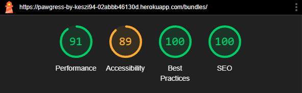
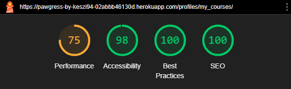
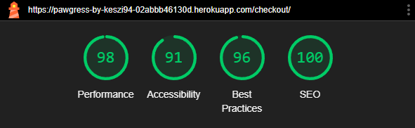

# Testing - Pawgress

Note: This document focuses solely on the testing process and results for the Pawgress project. For the full project overview, including features, deployment and credits, please refer to the [README.md.](README.md) file.

## Contents

  - [Manual Testing](#manual-testing)
    - [Navigation](#navigation)
    - [Responsiveness](#responsiveness)
    - [Authentication](#authentication)
    - [CRUD Functionality](#crud-functionality)
  - [Automated Testing](#automated-testing)
  - [Validator Testing](#validator-testing)
    - [PEP8](#pep8)
    - [W3C](#w3c)
    - [JSHint](#jshint)
  - [Accessibility \& Performance](#accessibility--performance)
    - [WAVE](#wave)
    - [Lighthouse](#lighthouse)
  - [Bugs \& Bug Fixes](#bugs--bug-fixes)


## Manual Testing

### Navigation

**Test**|**Steps**|**Expected**|**Result**
-----|-----|-----|:-----:
Home page loads from URL|Enter the website URL in the browser|Home page displays correctly|Pass
Clicking on the site logo redirects to Home|Click on the site logo on any page|Redirects to the home page|Pass
Navigate to "All Courses" via navbarr|Click 'All Courses' menu item in the navbar|Courses page loads|Pass
Navigate to "Course Bundles" via navbar|Click 'Course Bundles' menu item in the navbar|Bundles page loads|Pass
Search functionality in navbar|Type a keyword in the search bar and click search|Search results show relevant courses|Pass
Dropdown menu for categories displays correctly|Click 'Categories' menu item in the navbar|Dropdown expands and shows category options|Pass
Selecting a category displays relevan tcourses|Click on a category from the dropdown|Courses under the selected category are displayed|Pass
Clicking on the category on a course card displays all relevant courses|Click on a categry on a course card|Courses under the selected category are displayed|Pass
Navbar collapses on small screens|Resize window to mobile size|Hamburger menu appears|Pass
Mobile menu expands correctly|Click hamburger icon|Mobile nav menu expands with links|Pass

### Responsiveness

**Test**|**Steps**|**Expected**|**Result**
-----|-----|-----|:-----:
Navbar adapts to screen size|Resize browser window or view on different devices|Navbar colapses into a hamburger menu on smaller screens|Pass
Logo displays under navbar on small screens|View all pages on small screens|Logo displays in top left of the page, blow navbar|Pass
Course cards are responsive|View Courses page on various screen sizes|Cards display properly and inline on smaller screens|Pass
Bundle cards are responsive|View Bundles page on various screen sizes|Cards display properly and inline on smaller screens|Pass
Forms adapt to smaller screens|Test and checkout/authentication/new course form fields on mobile|Form fields stack properly and remain usable|Pass
Hero section adapts on home page|View header text and "Browse Courses" button on different devices|Text resizes and button remains clickable and visible, text displays on semi-transparent white background|Pass
Newsletter and About sections stack properly|View home page on mobile|Sections stack vertically and remain aligned under hero text|Pass

### Authentication

**Test**|**Steps**|**Expected**|**Result**
-----|-----|-----|:-----:
Register with valid info|Go to Register page and fill out form with valid info|Confirmation email is sent with link|Pass
Register with existing email|Try registering with an already used email|Error message displayes, registration denied|Pass
Registration email link works|Register a new account, click link in confirmation email|Email link redirects to page, confirms account creation|Pass
Login with correct credentials|Go to Login page, enter valid username/email and password|logged in and redirected to home page, success message shows|Pass
Login with incorrect credentials|Enter wrong credentials on Login page|Error message appears, login fails|Pass
Logout as logged-in user|Click “Logout” from profile navbar icon dropdown|Logged out and confirmation message shows|Pass
Access login restricted page while logged out|Go to /my_courses without while loogged out|Redirected to login page|Pass
Use Google sign-in|Click “Continue with Google” on Login page and confirmation page|Redirects to Google login|Pass
Password reset request|Click “Forgot password?”, submit account email|Reset password email is sent with link|Pass
Password reset email link works|Click the reset link received in teh email|Link opens reset form correctly|Pass
Login with new password|Log in after password reset|Authentication works, redirected to home page|Pass
Access signup page while logged in|Try opening signup page with direct URL while already logged in|Redirected to home page|Pass

### Purchases

**Test**|**Steps**|**Expected**|**Result**
-----|-----|-----|:-----:
Add individual course to cart|Click “Add to Cart” on a course card|Course is added and success toast is shown|Pass
Add individual course again|Click “Add to Cart” on same course again|Info toast appears: item already in cart, item is not added to cart|Pass
Add bundle to cart|Click “Add to Cart” on a bundle card	|Bundle is added and success toast is shown|Pass
Add duplicate bundle|Click “Add to Cart” on same bundle again|Info toast: bundle already in cart, bundle is not added to cart|Pass
Add bundle containing already added course|Add a course to cart, then bundle including that course|Info toast: course in bundle already in cart|Pass
Add bundle containing already owned course|Log in, buy a course then try to add bundle with that course in it|Bundle is added to cart, success toast displays, warning toast lists already owned course(s)|Pass
Add course already owned|Try to add already purchased course to cart|Info toast: course already owned, not added to cart|Pass
View cart|Click cart icon in navbar|Cart page displays with correct items and prices|Pass
Remove course from cart|Click “Remove” icon next to course|Course is removed from cart, success toast shown|Pass
Remove bundle from cart|Click “Remove” icon next to bundle|Bundle is removed from cart, success toast shown|Pass
Empty cart message|Remove all items|Empty cart message and "Back to courses" button displays correctly|Pass
Proceed to checkout|Click “Secure Checkout” button in cart|Checkout page with billing address/card details form is displayed|Pass
Submit invalid checkout form|Leave fields blank or incorrect|Form shows validation errors|Pass
Complete checkout with Stripe|Fill out checkout, submit test Stripe detais|Order processes, success page displays|Pass
View checkout success|After Stripe payment, view success page|Order summary displays, courses added to profile, purchase email is sent|Pass
Purchase recorded in database|Check admin panel "Purchases"|Purchase appears with correct details|Pass

### Access

**Test**|**Steps**|**Expected**|**Result**
-----|-----|-----|:-----:
View course detail (not owned)|Visit course page as anonymous or logged-in user without purchase|Page displays image, description, duration, message about needing purchase and att to cart button|Pass
View course detail (owned)|Purchase course, then return to course page|Full content displays below course details|Pass
Access course from bundle|Purchase a bundle, then access one of its courses (from included courses list/courses page)|Course is owned, full content is visible|Pass
Mark course as completed|On “My Courses” page, click checkbox next to owned course|Checkbox is checked, visible confirmation for completion|Pass
Create course as admin|Log in as superuser, navigate to “Add New Course”|Access granted to add form|Pass
Create course as non-admin|Log in as normal user/stay logged out, attempt to access “Add New Course” via direct URL|Redirected to home page, error toast displays|Pass
Edit course as admin|Log in as superuser, "Edit" option displays on course cards, click “Edit”|Course edit form loads with prefilled values|Pass
Edit course as normal user|Log in as normal user, attempt to access edit via direct URL|Redirected to home page, error toast displays|Pass
Delete course as admin|Log in as superuser, click “Delete” on course|Confirmation prompt shown, course is removed after confirmation|Pass
Admin can view all course content at all times|Log in as Admin, open not owned course's detail page|The whole course content displays|Pass

### CRUD Functionality 

**Test**|**Steps**|**Expected**|**Result**
-----|-----|-----|:-----:
Admin can access "Add New Course" page|Log in as superuser, naigate to /courses/create/ or use direct link|Course creation form displays|Pass
Course form fields accept valid input|Fill out form with valid title, description, contet, image, category, price, duration, click "Submit"|New course is created and confirmation toast appears|Pass
New course appears on the Courses page|After creating a course, go to Courses page|Course card displays with all provided info|Pass
New course can be previewed by clicking on it|Click on course card from Courses page|Course detail page displays with course info|Pass
"Edit" link is visible to admin only|Log in as regular user, check course cards thhen repeat while logged in as admin|Edit button not visible for regular users, only for superusers|Pass
Admin can edit course details|Log in as superuser, click "Edit" on course and modify data and submit|Updates reflect on course detail and Courses page|Pass
Edit form is pre-filled|Click "Edit" on an existing course|Form fields display current course data|Pass
Admin can delete a course|Click "Delete" on a course, confirm deletion in popup|Course is removed from Courses page and success toast displays|Pass

## Automated Testing

A number of automated tests have been written to provide additional validation alongside the manual tests.

### bundles app
[bundles app tests.py file](bundles/tests.py)

#### Tests include:

* Model tests:
  
  * String representation of bundles
  * Auto-generating slugs from titles
  * Accurate count of related courses
  * Correct calculation of total bundle value and savings when courses are added or bundle price is updated

* View tests:

  * All bundles view returns a 200 OK response
  * The correct template is rendered (bundles.html)
  * The view context comntains the expected bundle data
    
    

---
### cart app
[cart app tests.py file](cart/tests.py)

#### Tests include:

* Context processor tests:

  * Cart items (courses and bundles) are correctly fetched from the session
  * Total price and product count are accurately calculated
  * Course and bundle titles appear in the cart data

* View tests:

  * The cart page renders with status code 200 and uses the correct template
  * Courses and bundles can be added to and removed from the cart
  * Already owned courses cannot be added again and a warning message is shown

    

---
### checkout app

* [checkout app tests.py file](checkout/tests.py)

#### Tests include:

* Models:

  * Purhase and PurchaseItem string representation
  * Purchase number generating and total updates
  * Purchase item totals for both courses and bundles

* Views:

  * Redirect if the cart is empty during checkout
  * `checkout_success` correctly marks a purchase as paid and grants access

* Webhooks:

  * Stripe webhook handler responds to valid `payment_intent.succeeded` events
  * Invalid events are rejected

* Forms:

  * Purchase form accepts valid input
  * Validates required fields and coountry selection
  
    

---
### courses app

* [courses app tests.py file](courses/tests.py)

#### Tests include:

* Models:

  * String representation for Course and Category
  * Auto-generating slug
  * Time frame display logic

* Views:

  * Course list view renders correctly and includes the expected course
  * Superusers can access course creation and full content
  * Regukar users and anonymous users are redirected from restricted content

* Forms:

  * Course form validates with complete data
  * Errors are raised when required fields are missing

    

### profiles app

* [profiles app tests.py file](profiles/tests.py)

#### Tests include:

* Models:

  * CourseCompletion string output reflects completion status
  * `completed ` defaults to False
  * Enforces one completion record per user-course pair

* Views:

  * `my_courses` view displays purchased courses and uses the correct template
  * `toggle_completion` creates a completion record and correctly toggles its status

    

---
During each test run I recieved the same warning: `CKEditor isn't supported anymore`. After looking into it, I decided to not upgrade to CKEditor 5 and continue using CKEditor 4.22.1 because the current security risks are not immediate or critical for my project. The current version remains functional and stable for my project’s scope.


## Validator Testing

### PEP8

All Python files were put through the [PEP8 CI tool](pep8ci.herokuapp.com). No issues were found in custom project files. 

After running `flake8` in the terminal, the only warnings that appeared were in auto-generated files like migrations.py or defaullt app boilerplate. Where appropriate, I used # noqa (e.g., on the environment variable import for env in settings.py).

### W3C

* HTML

  All HTML templates were checked using the [W3C HTML Validator](https://validator.w3.org/). The only warnings were related to Django’s template syntax such as `` and `{{ variable }}`, which the validator doesn’t recognize. Another common note was the missing lang attribute on the <html> tag. This is handled in base.html, which all templates extend with ``.

  

  Besides these warnings, no actual HTML structure issues were found in the templates.

* CSS

  Both checkout.css and base.css have been passed through the [W3C CSS Validator](https://jigsaw.w3.org/css-validator/) and confimred to be free of any errors.

  

### JSHint

All JavaScript code, including the contents of the postloadjs blocks and the separate stripe_element.js file was passed through [JSHint](https://jshint.com/) with no issues reported.


## Accessibility & Performance

### WAVE

All pages were tested for accessibility using the [Wave Chrome Extension](https://chromewebstore.google.com/detail/wave-evaluation-tool/jbbplnpkjmmeebjpijfedlgcdilocofh).

Across all pages, there were 2 warnings related to the navigation bar: an empty search button and a missing label on the search bar and search button. These were intentional visual design choices and do not affect usability. Additional page-specific warnings were:

* Home page: Missing form labels in the newsletter form and a skipped heading level, both stylistic decisions.

* Add Course page: Missing form labels related to CKEditor fields and multiple warnings on the CKEditor field.

* Courses and Bundles pages: Some small text elements were flagged for bad color contrast (categories, savings). I double checked these using the [Coolors contrast checker](https://coolors.co/contrast-checker/112a46-acc8e5) and adjusted the text colors to improve readability.


### Lighthouse

Lighthouse was used to generate performance and accessibility reports for both the desktop and mobile versions of the site.

Under each page name, the first image shows the performance scores for mobile devices, while the images on the bottom show the desktop test results.

* Home page:

  
  

* Courses page:

  
  

* Bundles page:

  
  

* My Courses page:

  
  

* Cart page:

  
  

* Checkout page:

  
  

* Checkout Success page:

  
  

* Course Detail page:

  
  

* Add Course page:

  
  

* Register page:

  
  

* Login page:

  
  

* Google Authentication page:

  
  

* Logout page:

  
  

* 404 page:

  
  

## Bugs & Bug Fixes

1. Git Push Rejected – Remote Contains Work That You Do Not Have Locally

    When attempting to push the initial project commit to GitHub,  the following error occurred:

    `failed to push some refs to 'https://github.com/Keszi94/pawgress.git'`

    `Updates were rejected because the remote contains work that you do not have locally.error: failed to push some refs to 'https://github.com/Keszi94/pawgress.git'`

* Cause:

  This happened because I had created a GitHub repository first (without cloning it), then committed the files locally, including the README.md. Both the remote and local repositories had separate commit histories, so Git couldn't automatically merge them.

* Solution:

  To resolve the issue, I used the following command to allow unrelated histories to merge:

  `git pull origin main --allow-unrelated-histories`

  This successfully merged the remote and local histories and I was able to push my code as expected.

* Resources:

    * [Solution found on this page](https://stackoverflow.com/questions/37937984/git-refusing-to-merge-unrelated-histories-on-rebase)

---

2. ImproperlyConfigured – Missing AccountMiddleware in MIDDLEWARE

    When running the initial database migration after installing django-allauth, the following error occurred:

    `django.core.exceptions.ImproperlyConfigured: allauth.account.middleware.AccountMiddleware must be added to settings.MIDDLEWARE`

* Cause:

  I was unaware that the recent version of Django AllAuth requires AccountMiddleware to be included in the MIDDLEWARE list in settings.py. 

* Solution:

  To resolve the isuue, I added the following line to the MIDDLEWARE list in settings.py:

  `'allauth.account.middleware.AccountMiddleware',`

  After this I ran the `python manage.py migrate`command and it worked as expected.

* Resources:
  
    * [StackOverflow](https://stackoverflow.com/questions/77012106/django-allauth-modulenotfounderror-no-module-named-allauth-account-middlewar?utm_source=chatgpt.com)

---

3. DeserializationError – Category ForeignKey in fixture requires integer, not string

* Cause:

  While trying to run `python manage.py loaddata courses`, a ValidationError was raised because the category values were provided as strings ("Puppy Training"), rather than integer primary keys that are expected by Django's ForeignKey.

* Solution:

  I have created a separate categories.json fixture, where I assigned each category it's own integer primary key. I than ran:

  `python manage.py loaddata categories`
  `python manage.py loaddata courses`

  After this, all course data was successfully imported into the database.

* Resources: 
  
    * [reddit](https://www.reddit.com/r/django/comments/10zift2/help_me_understand_how_to_load_data_into_the/), [Dev.to](https://dev.to/documendous/using-django-fixtures-with-foreign-keys-without-hardcoded-ids-1pa0)

---

4. Images in Admin Panel Show 404 Error (/media/media/...)

    When clicking on images linked to courses on the Admin page, the following error displayed: "Page Not Found (404)".

* Cause:

    I have incorrectly set the ImageField in the Course model to `upload_to='media/'`,  which caused Django to create duplicate paths (media/media/). After I updated that Course model, the error still displayed. That’s when I realised that I have also included `”media/` at the start of the “image” paths (`"media/puppy_leash.jpg"`) in the course.json file, which led to the same issue.

* 	Solution:

    First, I have updated the Course model so that the ImageField doesn't add an extra "media/": `image = models.ImageField(upload_to='', blank=True, null=True)`. 
    After that I’ve removed all “media/” prefixes from the “image” fields in courses.json and then re-ran `python manage.py loaddata categories` and `python manage.py loaddata courses`.

---

5. TypeError – 'NoneType' object is not iterable when trying to filter courses by category

    While trying to filter courses by category using the `?category=...` query string, I got a TypeError that said `'NoneType' object is not iterable` in this code:

    ```python
    categories = None 

    if request.GET: 
      if 'category' in request.GET:
        courses = courses.filter(category__name__in=categories)
    ```

* Cause:
  
  I was trying to filter using `category__name__in=categories`  but `categories` was still set to `None`. I hadn’t turned the query string into a list, so Django couldn’t loop through it and apply the filter. Also, I was passing in slugs (eg. "puppy-training") in the URL, but my category filtering was expecting exact category names (eg."Puppy Training"), which didn’t match.

* Solution:

  I added a slug field to my Category model:

  ```python
  slug = models.SlugField(unique=True, blank=True)
  ```

  I also updated the model’s save() method using slugify() to automatically create a slug from the name. Then I changed my view to get the category by its slug instead of name.

*	New Problem:

    After making these changes, I ran into a new issue when migrating: `IntegrityError: UNIQUE constraint failed: courses_category.slug`. This happened because my slug field had unique=True, but my database already had existing categories with no slug values.

* Final Fix:

  I removed unique=True temporarily:

  ```python
  slug = models.SlugField(blank=True, null=True)
  ```

  I then deleted the old mgration files from the courses/migrations folder and ran a migration again.

  Then, I	Backfilled all slugs via the Django shell:

  ```python
  from courses.models import Category
  from django.utils.text import slugify

  for category in Category.objects.all():
    category.slug = slugify(category.name)
    category.save()
  ```

  After I tested the website and everything worked I added `unique=True` to the models again, migrated and selected option 2 when prompted for how to handle NULLs.

  Filtering by category using `?category=slug` now works perfectly. The category dropdown links also function as they expected to.

* Resources:
  
    * [Django Docs](https://docs.djangoproject.com/en/5.2/ref/models/fields/) 
    
    * various threads on Stack Overflow:
    [Changing model field within the Django Shell](https://stackoverflow.com/questions/32899609/changing-model-field-within-the-django-shell) |
    [How to auto fill SlugField instead of overriding save()?](https://stackoverflow.com/questions/50615561/how-to-auto-fill-slugfield-instead-of-overriding-save) |
    [UNIQUE constraint failed on adding a new model field in django](https://stackoverflow.com/questions/58631272/unique-constraint-failed-on-adding-a-new-model-field-in-django)

---

1. `AssertionError` and `ImproperlyConfigured` errors when starting the server (django-allauth compatibility)

    After restarting my computer, I suddenly couldn’t run the development server anymore. Running `python manage.py runserver` threw an `AssertionError` related to `allauth.account.app_settings`, and later a `ModuleNotFoundError` for middleware that didn’t exist. This was strange because everything had worked the day before.

* Cause:
  
  I was using an older settings.py setup for django-allauth, which worked with older versions, but now I had installed newer versions, and these have more strict requirements.
  In particular, I had settings like:


  ```python
  ACCOUNT_LOGIN_METHODS = {"username", "email"}
  ```
  I also had an invalid middleware line: 


  ```python
  'allauth.account.middleware.AccountMiddleware'
  ```

* Solution:

    *	I deleted the invalid middleware line from settings.py.

    *	I have changed the incorrect login method setting to this: 
    ```python
    ACCOUNT_AUTHENTICATION_METHOD = "username_email"
    ```

    * 	Using windows PowerShell, I removed my broken virtual environment and rebuilt it to match the project dependencies:
    ```
    Remove-Item -Recurse -Force .venv
    python -m venv .venv
    .venv\Scripts\Activate.ps1
    pip install -r requirements.txt
    ```
    
  After implementing all these changes, the server ran again with no errors.

* Resources:

    * [Allauth Quickstart](https://docs.allauth.org/en/dev/installation/quickstart.html?utm_source=chatgpt.com)

    * [Allauth Configuration](https://docs.allauth.org/en/dev/account/configuration.html?utm_source=chatgpt.com)
  
---

1. Submitting an empty search field redirects to the `/courses/` page

    When submitting the global search form without entering any text (from the homepage or any other page), I was unexpectedly redirected to the courses page even though the view correctly the empty input.

* Cause: 
    
    In my `all_courses` view I have logic to detect empty search queries: 

    ```python
    If not query:
    messages.error(request, "Please type a course name or keyword to start searching.")
 	    return redirect(reverse('courses'))
    ```

    The problem is that the redirect logic always sends the user to the `courses page`


* Solution:

    I changed the redirect logic to use the `HTTP_PREFERER` header instead:

    ```python
    Return redirect(request.META.get('HTTP_REFERER', reverse('courses')))
    ```

    This way, the user is redirected to the page they were on when pressing the search button.
    I also added `.strip()` to the query input so that space-only searches are treated as an empty search field: 
    
    ```python
    query = request.GET['q'].strip()
    ```

* Resources:
    
    * [Django Docs]( https://docs.djangoproject.com/en/5.2/ref/request-response/#django.http.HttpRequest.META)

---

1. Checkout throws error for missing country field despite it being in initial migration
 
    During testing, submitting a purchase form resulted in a server error claiming the `country` field was missing from the Purchase model. The field was already present in my 0001_initial.py, and migrations had been applied. After some debugging, I found online advice suggesting to delete `db.sqlite3`, assuming that would reset things. I didn’t realize this would also delete all the data. This led to fixture load failures, missing superuser, duplicate slug errors, and the loss of bundle data.

* Cause:

    Deleting `db.sqlite3` removed not just data, but the entire schema. Upon re-running migrate, the initial migration lacked country, likely due to earlier inconsistent migration states. Fixture files were also outdated or malformed, missing required fields or causing `UNIQUE`/`NOT NULL` errors.

* Solution:
  
    Manually fixed fixture files to include all required fields (`created_at`, `updated_at`, `unique slugs`), then recreated the database with `python manage.py migrate` and reloaded the corrected fixtures. Readded the superuser and manually recreated bundles via the admin panel.

* Resources:

    I asked [ChatGPT](https://chatgpt.com/)to create the slug fields from the names/titles so I can paste them into the json files.

---

9. Deleting a course causes the entire site to crash if the course was in a user's cart

    During testing, I added a course to the cart via the front-end and later deleted that course in the Django admin panel. Upon reloading the site, every page immediately returned a `Course.DoesNotExist` error. Even the homepage, which didn’t visibly display any course or cart content, became completely inaccessible.

* Cause:
  
    The crash was caused by the cart_contents context processor. It used get_object_or_404() to retrieve course and bundle objects based on IDs stored in the session cart:

    ```Python
    course = get_object_or_404(Course, pk=item_id)
    ```

    When a course in the cart was deleted, this raised a `Http404` exception, breaking the entire request before the templates were rendered. Since the context processor is loaded in base.html globally, every page broke, including the ones not related to courses.
    Further, toast_success.html included logic like:

    ```django
    
      {{ item.course.title }}
    
    ```

    This also raised errors if `item.course` no longer existed.

* Solution:

  *	I replaced all get_object_or_404() calls in the context processor with safe try...except blocks:
    
    ```python
    try:
        course = Course.objects.get(pk=item_id)
    except Course.DoesNotExist:
        continue
    ```

  *	Updated the cart preview section in toast_success.html to guard every item access:
        
    ```python
    try:
        course = Course.objects.get(pk=item_id)
    except Course.DoesNotExist:
        continue
    ```

  * Wrapped the cart rendering logic with:

    ```django
    
    ```

    …to avoid attempting to display empty or broken cart states.

  After these changes the site’s stability was restored. It no longer crashes when a deleted item remains in a user's cart. 
  
* Resources:

    * [Django docs]( https://docs.djangoproject.com/en/5.2/ref/templates/api/#writing-your-own-context-processors)
    * [boutique_ado_v1](https://github.com/Code-Institute-Solutions/boutique_ado_v1)

---

10. Bundle creation error in admin panel

    While trying to add a new bundle through the admin, I got this error: `<Bundle: Test Bundle>" needs to have a value for field "id" before this many-to-many relationship can be used.`

* Cause: 
   
    I had code in the `save()` method of the Bundle model that tried to access the list of courses (a many-to-many field) before the bundle was actually saved. But Django doesn't let you work with M2M fields until the object has an ID, which only happens after it’s saved.

* Solution :

    * I deleted the following M2M price calculation code from the save() method in :
    
    ```python
    course_prices = (
        self.courses.aggregate(total=models.Sum('price'))['total'] or 0.00
        )
    self.total_value = course_prices
    self.savings = (
        course_prices - self.price
        ).quantize(Decimal('0.01'), rounding=ROUND_HALF_UP)
    ```

    *	I kept the signal `@receiver(m2m_changed)` in update_bundle_totals, which updates the total value and savings automatically whenever courses are added or removed from a bundle . Now the bundle saves without crashing, and the total and savings fields still update as expected.

* Sources: 

    * [Django docs](https://docs.djangoproject.com/en/5.2/ref/models/fields/#manytomanyfield)
    * [Django docs](https://docs.djangoproject.com/en/5.2/ref/signals/#m2m-changed)
  
---

11. AWS S3 Failed for Static & Media Files on Heroku - Switched to Cloudinary + WhiteNoise

    I originally planned to use AWS S3 for both static and media files. Following the Boutique Ado walktrough project I set up the django-storages and AWS credentials. Neither static nor media files were actually being uploaded or served.

* Static File Issue (Never Reached S3)
  
    I configured S3 for static files using:

    ```python
    STATICFILES_STORAGE = 'storages.backends.s3boto3.S3Boto3Storage'
    ```

    And set all required AWS environment variables via Heroku’s config panel.

  * Problem:

    Static files never uploaded to S3. Even with USE_AWS = True, Django didn’t route static files to S3, and Heroku required STATIC_ROOT locally or collectstatic would fail during deployment. This defeated the point of using S3.

  * Solution:

    I dropped S3 for static files and switched to WhiteNoise, which worked immediately.

    ```python
    STATICFILES_STORAGE = 'whitenoise.storage.CompressedManifestStaticFilesStorage'
    ```

* Media File Upload Issue (Blocked by Permissions & Fallbacks)

    To handle uploaded images, I created a custom media storage class:

    ```python
    class MediaStorage(S3Boto3Storage):
        location = settings.MEDIAFILES_LOCATION
        default_acl = 'public-read'
    ```

    Then set in settings.py:
    ```python
    DEFAULT_FILE_STORAGE = 'custom_storages.MediaStorage'
    MEDIA_URL = f'https://{AWS_STORAGE_BUCKET_NAME}.s3.amazonaws.com/media/'
    ```

  * Problem:
    Even though the code was correct, media uploads defaulted to FileSystemStorage. No media made it to the S3 bucket.
    
    What I Tried:

    1. Reordering settings to define DEFAULT_FILE_STORAGE earlier
    2. Hardcoding values
    3. Running shell tests: `default_storage.__class__` always returned `FileSystemStorage`
    4. Boto3 test showed: AccessDenied for S3 API

* Final Solution:
    I ended up using Cloudinary for Media and WhiteNoise for Static files.

    After a full day of debugging and dead ends with AWS, I uninstalled all S3 related packages and switched to Cloudinary for media uploads and WhiteNoise for static file serving

    ```python
    DEFAULT_FILE_STORAGE = 'cloudinary_storage.storage.MediaCloudinaryStorage'
    STATICFILES_STORAGE = 'whitenoise.storage.CompressedManifestStaticFilesStorage'
    ```

    Added to INSTALLED_APPS:

    ```python
    'cloudinary_storage',
    'cloudinary',
    ```

  After all the fixes and changes the Static files load cleanly with WhiteNoise and the Media uploads are now sent to Cloudinary.

* Sources:

    * [WhiteNoise Docs](https://whitenoise.evans.io/en/stable/)
    * [DJango Docs - storages, S3 Setup](https://django-storages.readthedocs.io/en/latest/backends/amazon-S3.html)
    * [Cloudinary Docs](https://cloudinary.com/documentation/django_image_and_video_upload)
    * [AWS Docs - access denied error messages](https://docs.aws.amazon.com/IAM/latest/UserGuide/troubleshoot_access-denied.html)
    * [Heroku Dev center](https://devcenter.heroku.com/articles/django-assets)
    * [Django Docs - default file storage](https://docs.djangoproject.com/en/stable/ref/settings/#default-file-storage)

---

12. Unauthenticated User Access Error in course_detail View

    When a logged-out user tried to access the course detail page, the app threw an error when attempting to query Purchase.objects.filter(user=request.user) because `request.user` isn't a valid user object in that context.

* Cause:

    The course_detail view checked for course ownership without first verifying if the user was authenticated, which led to wrong database queries for anonymous users.

* Solution:

    I added a proper ` if request.user.is_authenticated` check before querying purchases to avoid running user specific logic for unauthenticated users.

    ```python
    if request.user.is_authenticated and request.user.is_superuser:
        has_access = True
    elif request.user.is_authenticated:
        purchases = Purchase.objects.filter(user=request.user, access_granted=True)
    ```

  Now the page displays as expected to all users, logged in or not. Superusers always have access to course content, authenticated users see their purchased courses and their content but not the content of un-purchased courses, same as the anonymous users.

---

13. Bundle Savings Not Updating on Price Change

    When editing a bundle’s price in the admin panel, the “savings” and actual value fields did not update to reflect the new price. This meant the site was still displaying outdated savings values even after manual price changes.

* Cause:

    The recalculation logic was originally only tied to changes in course relationships (via an m2m_changed signal), not the price updates.

* Solution:

    I moved the logic that updates the `total_value` and `savings` from the update_bundle_totals signal into the Bundle model’s save() method. This ensures that the calculations run every time the bundle is saved, for example when the price is edited:

    ```python
    total = self.courses.aggregate(
    total=models.Sum('price')
    )['total'] or Decimal('0.00')

    savings = (total - self.price).quantize(
        Decimal('0.01'), rounding=ROUND_HALF_UP)

    Bundle.objects.filter(pk=self.pk).update(
        total_value=total,
        savings=savings
    )
    ```

  After this addition, the savings now recalculate automatically based on the total value of the courses in the bundle minus the new bundle price.
